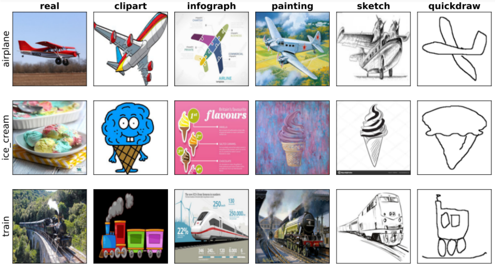
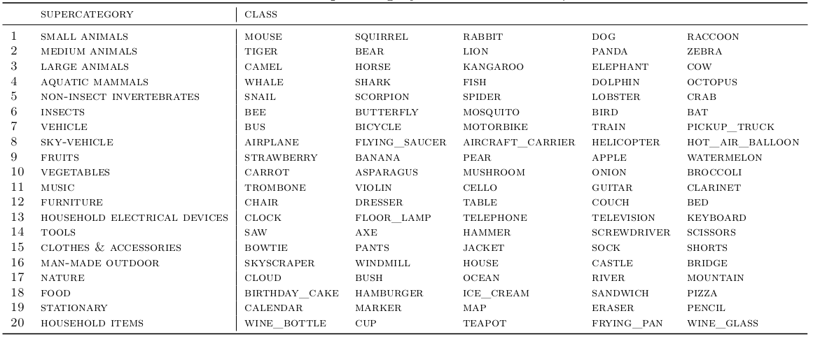
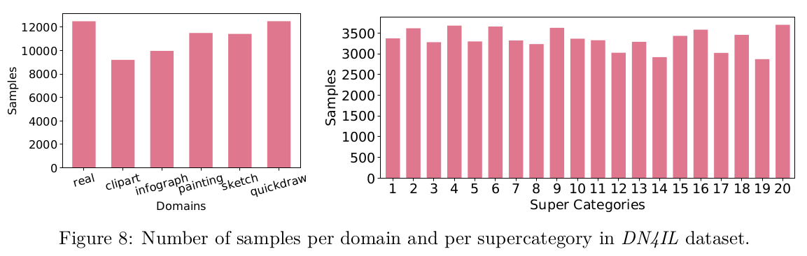
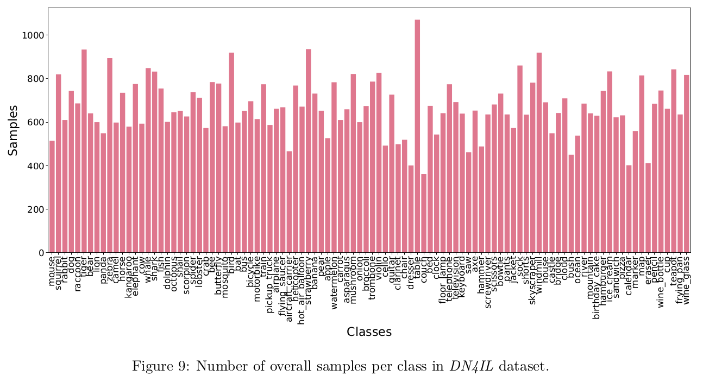

This is the novel DN4IL dataset introduced for Domain-Incremental setting in Continual Learning domain.
It was introduced in the TMLR paper, **"Dual Cognitive Architecture: Incorporating Biases and Multi-Memory Systems for Lifelong Learning"** by Shruthi Gowda, Elahe Arani and Bahram Zonooz (https://github.com/NeurAI-Lab/DUCA)

*DN4IL* is a subset of the standard DomainNet dataset used in domain adaptation. It consists of six different domains: real, clipart, infograph, painting, quickdraw, and sketch. The shift in distribution between domains is challenging. A few examples and statistics of the dataset can be seen below. 

### Dataset Usage

These new annotations can be used with the DomainNet dataset for training and evaluation in Continual Learning

### Dataset statistics

The original DomainNet consists of 59k samples with 345 classes in each domain. 
The classes have redundancy, and moreover, evaluating the whole dataset can be computationally expensive
in a CL setting. *DN4IL* version considers different criteria such as relevance of classes, 
uniform sample distribution, computational complexity, and ease of benchmarking for CL.

All classes were grouped into semantically similar supercategories. Of these, a subset of classes was selected 
that had relevance to domain shift, while also having maximum overlap with other standard datasets such as 
CIFAR, to facilitate out-of-distribution analyses. 20 supercategories were chosen with 5 classes each 
(resulting in a total of 100 classes). In addition, to provide a balanced dataset, we performed a 
class-wise sampling. First, we sample images per class in each supercategory and maintain class balance. 
Second, we choose samples per domain, so that it results in a dataset that has a near-uniform distribution 
across all classes and domains. The final dataset *DN4IL* is succinct, more balanced, and more 
computationally efficient for benchmarking, thus facilitating research in CL. 
The challenging distribution shift between domains provides an apt dataset to test the capability of CL 
methods in the Domain-IL setting.

Details on supercategory and classes in DN4IL dataset.

## Cite Our Work

## License

This project is licensed under the terms of the MIT license.

